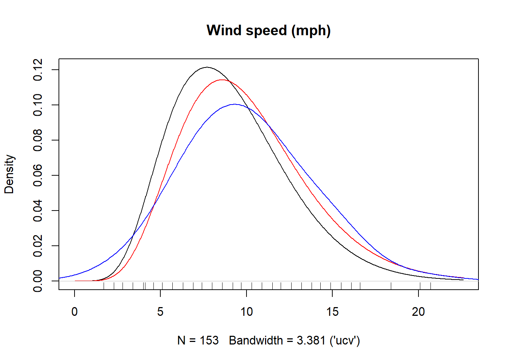

---
title: 'kdensity: An R package for kernel density estimation with parametric starts and asymmetric kernels'
tags:
  - R
  - statistics
  - kernel density estimation
  - non-parametric statistics
  - non-parametrics
  - non-parametric density estimation
  - boundary bias
authors:
  - name: Jonas Moss
    orcid: 0000-0002-6876-6964
    affiliation: 1
  - name: Martin Tveten
    orcid: 0000-0002-4236-633X
    affiliation: 1
affiliations:
 - name: University of Oslo
   index: 1
date: 11 July 2019
bibliography: paper.bib
---

# Summary
Estimating probability densities is an important task in many data science problems.
The R package [@r] `kdensity` is an alternative --- and in some cases, more correct ---
way of performing non-parametric density estimation than the standard `density` function
in R.
A primary reason for this is that `kdensity` allows one to 
specify the support of the density estimate through an initial parametric density estimate.

The `density` function is based on classical kernel density estimation [@silverman2018density],
where symmetric kernels are placed on each data point. 
@hjort_glad_1995 extended kernel density estimation with *parametric starts*.
The parametric start is a parametric density that is multiplied with the kernel
estimate. When the data-generating density is reasonably close to the parametric
start density, kernel density estimation with that parametric start will outperform
ordinary kernel density estimation.

Moreover, when estimating densities on the half-open interval $\left[0,\infty\right)$ and bounded intervals, such as $\left[0, 1\right]$, symmetric kernels are prone to serious boundary bias that should be corrected [@marron1994transformations]. 
Asymmetric kernels have been designed to avoid boundary bias and many of them are implemented in `kdensity` in addition to the classical symmetric kernels.
For the unit interval, the Gaussian copula kernel of @jones2007miscellanea and the beta kernels of @chen1999beta are supported. 
The gamma kernel of @chen2000probability is available for the half-open interval.

The supported non-parametric starts include the normal, Laplace, Gumbel, 
exponential, gamma, log-normal, inverse Gaussian, Weibull, Beta, and Kumaraswamy
densities. The parameters of all parametric starts are estimated using maximum 
likelihood. The implemented bandwidth selectors are the classical bandwidth 
selectors from `stats`, unbiased cross-validation, the Hermite polynomial method 
from @hjort_glad_1995, and the tailored bandwidth selector for the Gaussian 
copula method of @jones2007miscellanea. User-defined parametric starts, 
kernels and bandwidth selectors can also be set. 

Several `R` packages deal with kernel estimation, see @deng2011 for an overview. 
While no other `R` package handles density estimation with parametric starts, 
several packages supports methods that handle boundary bias. @evmix provides a 
variety of boundary bias correction methods in the `bckden` functions. @kde1d 
corrects for boundary bias using probit or logarithmically transformed 
local polynomial kernel density estimation. @logKDE corrects for 
boundary bias on the half line using a logarithmic transform. @ks supports 
boundary correction through the `kde.boundary` function, while @Ake corrects 
for boundary bias using asymmetric kernels.

The following example uses the `airquality` data set from the built-in
R package `datasets`. Since the data is positive we use Chen's gamma kernel. 
As the data is likely to be better approximated by a gamma distribution than a 
uniform distribution, we use the gamma parametric start. The plotted density is
in figure 1, where the gamma distribution with parameters estimated by maximum 
likelihood is in red and the ordinary kernel density estimate in blue. 
Notice the boundary bias of the ordinary kernel density estimator. 

```r
# install.packages("kdensity")
library("kdensity")
kde = kdensity(airquality$Wind, start = "gamma", kernel = "gamma")
plot(kde, main = "Wind speed (mph)")
lines(kde, plot_start = TRUE, col = "red")
lines(density(airquality$Wind, adjust = 2), col = "blue")
rug(airquality$Wind)
```


# References
